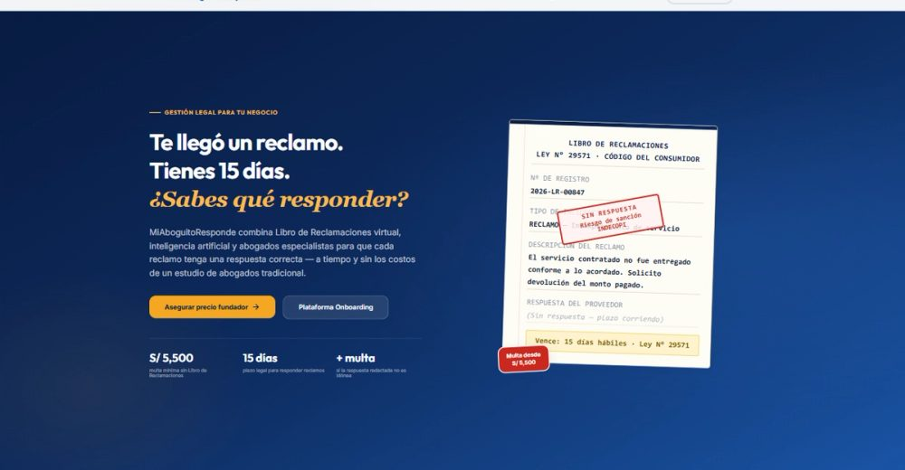
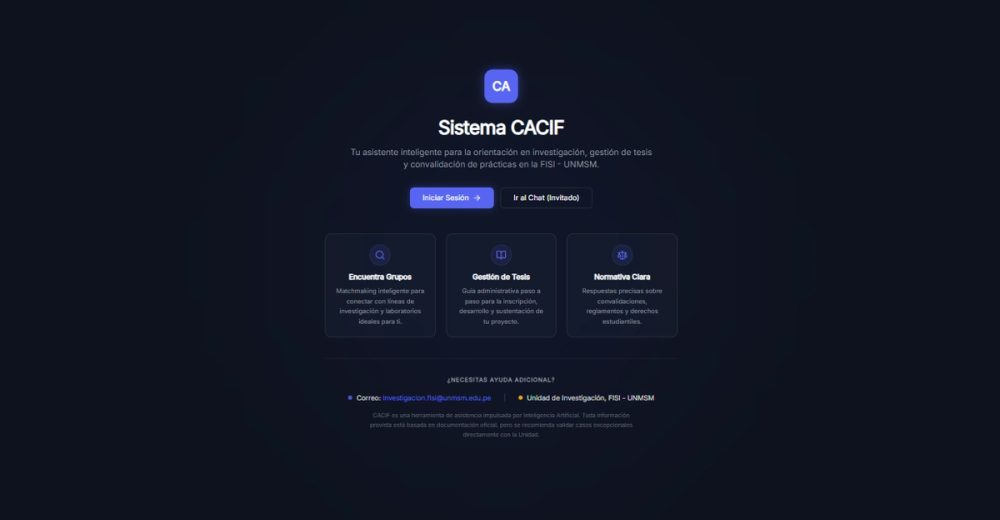
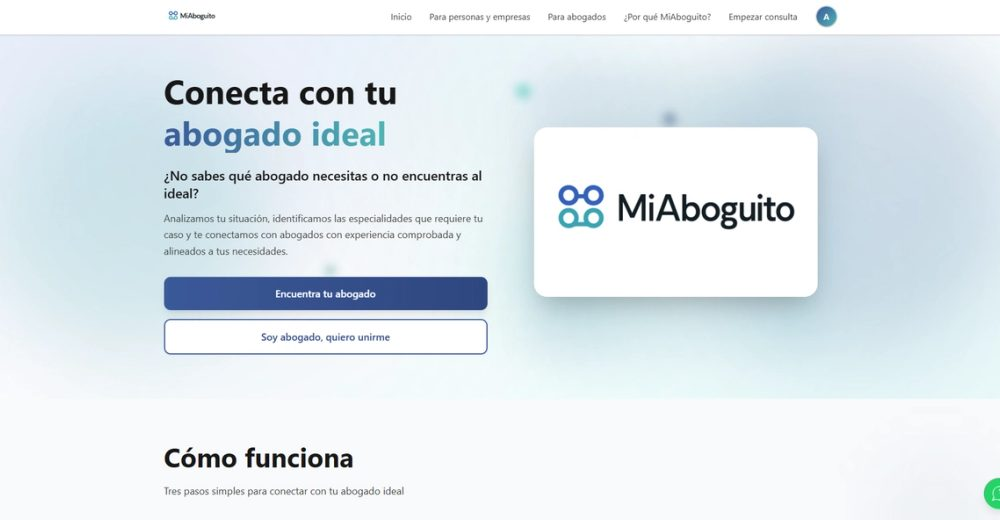
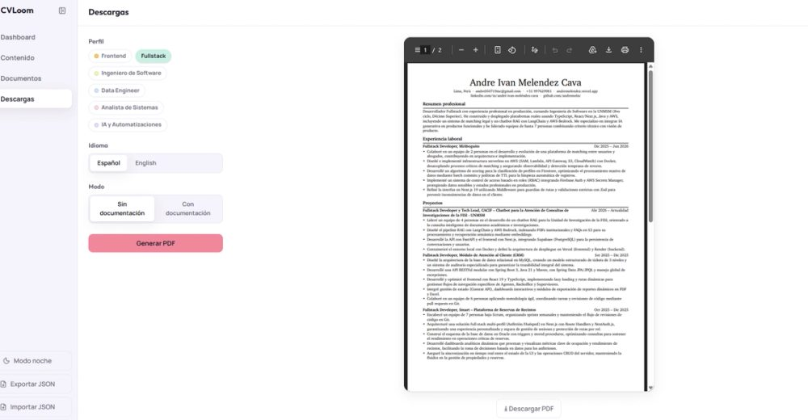
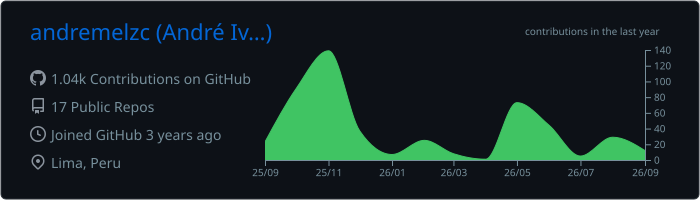
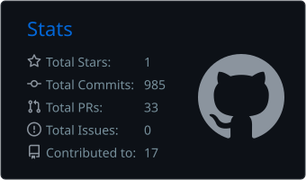
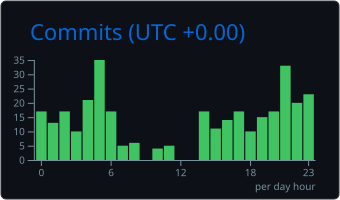
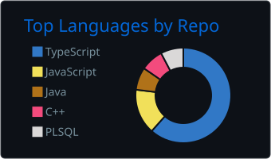
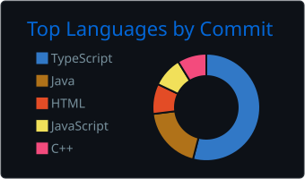

# Andre Meléndez

**Desarrollador Full-Stack**  ·  Estudiante de Ingeniería de Software @ UNMSM  ·  Lima, Perú

Construyo aplicaciones web full-stack de punta a punta. Últimamente trabajo bastante con
arquitecturas **serverless en AWS** y **sistemas RAG / IA aplicada**. Me interesan el diseño de
sistemas y las bases de datos.

---

## Proyectos

<table>
<tr>
<td width="50%" valign="top">

<h4>MiAboguito Responde&nbsp;·&nbsp;2026</h4>

Atención legal 24/7 con IA. Backend 100% serverless (AWS SAM · Lambda · DynamoDB) y clasificación automática de reclamaciones con Google Gemini.

<code>Next.js</code> <code>AWS Lambda</code> <code>DynamoDB</code> <code>Gemini</code>

<a href="https://responde.miaboguito.com/">Sitio&nbsp;↗</a>

</td>
<td width="50%" valign="top">

<h4>CACIF&nbsp;·&nbsp;2026</h4>

Chatbot RAG para consultas académicas de la FISI-UNMSM. Pipeline con LangChain + AWS Bedrock y embeddings en S3. Lideré un equipo de 4.

<code>FastAPI</code> <code>LangChain</code> <code>AWS</code> <code>Supabase</code>

<a href="https://cacif.vercel.app/">Demo&nbsp;↗</a> · <a href="https://github.com/andremelzc/Choclicode/tree/main/Desarrollo/CACIF/Codigo%20Fuente">Código&nbsp;↗</a>

</td>
</tr>
<tr>
<td width="50%" valign="top">

<h4>MiAboguito&nbsp;·&nbsp;2026</h4>

Sistema de matching legal: conecta usuarios con abogados mediante un algoritmo de scoring y clasificación de perfiles sobre infraestructura serverless.

<code>Next.js</code> <code>AWS Lambda</code> <code>Firestore</code> <code>Zod</code>

<a href="http://miaboguito.com/">Sitio&nbsp;↗</a> · <a href="https://github.com/andremelzc/frontend-miaboguito">Código&nbsp;↗</a>

</td>
<td width="50%" valign="top">

<h4>CVLoom&nbsp;·&nbsp;2026</h4>

Plataforma de generación dinámica de CVs: un solo origen de datos, soporte multi-perfil, filtrado dinámico y renderizado de documentos a nivel profesional.

<code>Next.js</code> <code>React</code> <code>Node.js</code>

<a href="http://cvloom-azure.vercel.app/">Demo&nbsp;↗</a> · <a href="https://github.com/andremelzc/cvloom">Código&nbsp;↗</a>

</td>
</tr>
</table>

Más proyectos (SkyApp, CompX…) en → <a href="https://andremelendez.vercel.app/">andremelendez.vercel.app</a>

---

## Stack

**Lenguajes** &nbsp; 

**Frontend** &nbsp;  &nbsp; React Native · React Query · Zod

**Backend & IA** &nbsp;  &nbsp; LangChain · RAG

**Cloud & DevOps** &nbsp; 

**Datos** &nbsp;  &nbsp; DynamoDB

**Herramientas** &nbsp; 

---

## Actividad

 

 

<picture>
  
</picture>

Los paneles de arriba se generan solos con GitHub Actions — pueden tardar unos minutos tras el primer push.
